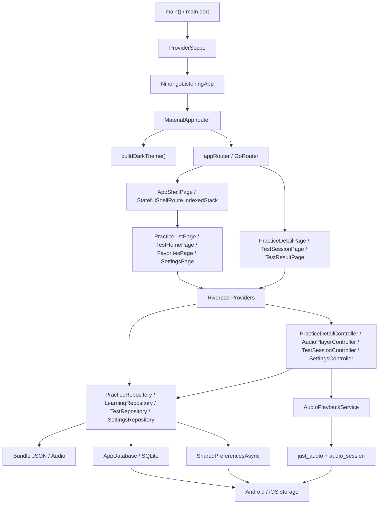
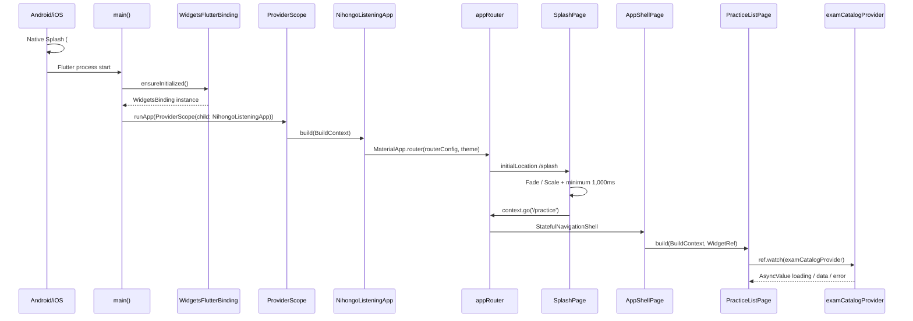
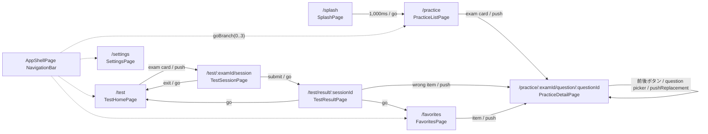
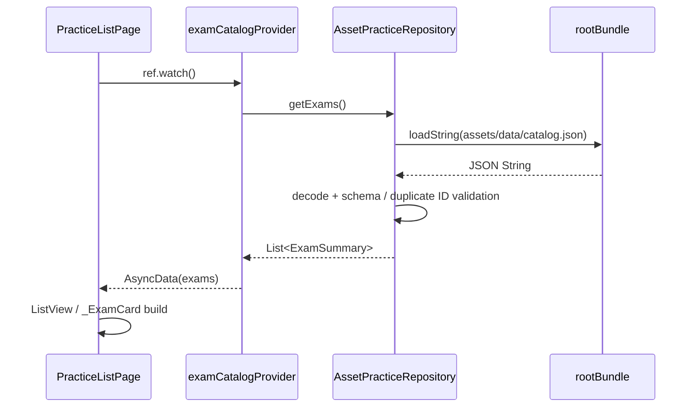
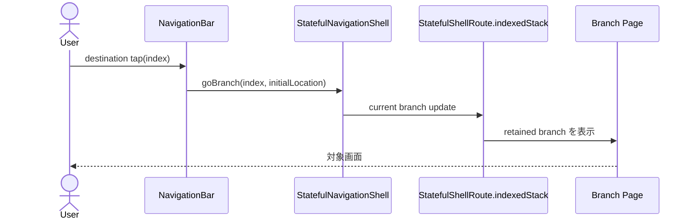
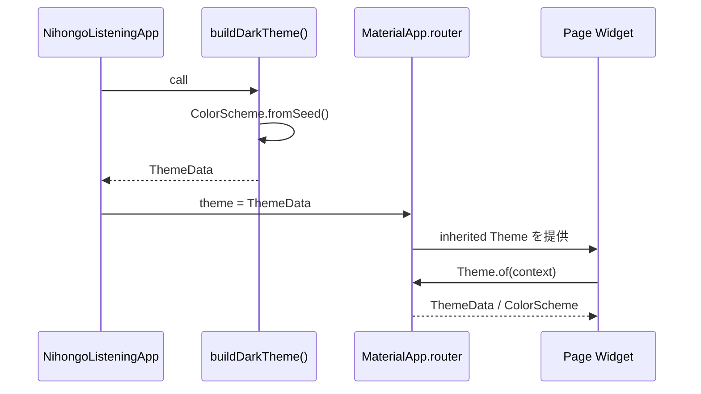
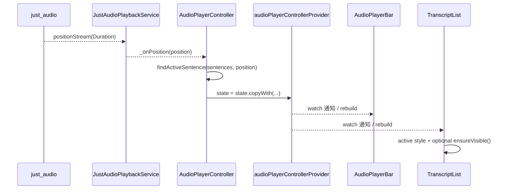
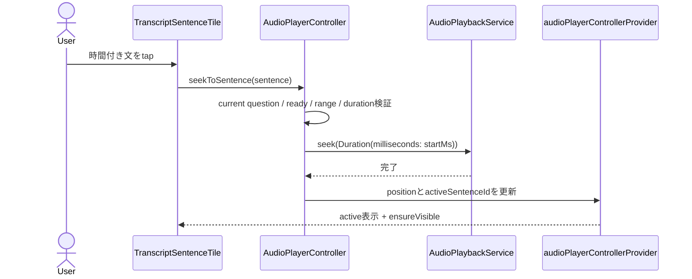
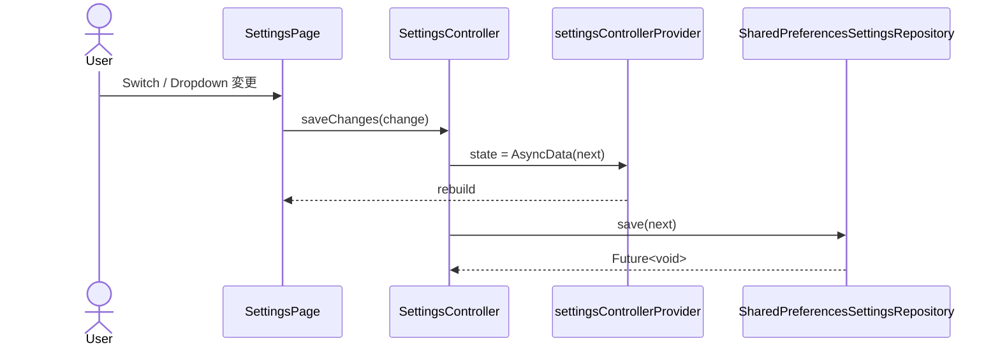
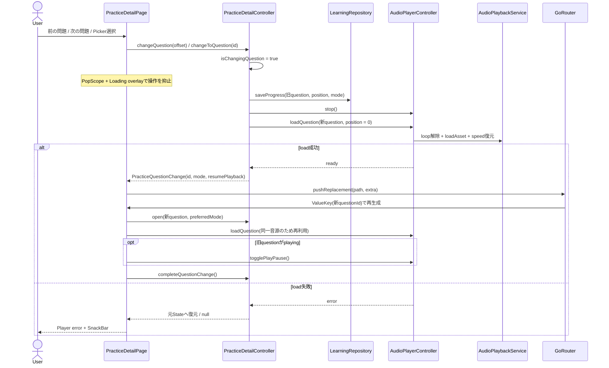

# 日本語リスニング学習アプリ 技術設計書

## 1. 文書概要

### 1.1 目的と対象範囲

本文書は、調査日時点のソースコード、設定、Package、画面、Router、Riverpod Provider、Widget 構成、永続化処理、音声処理、およびテストを根拠として作成した As-Built 形式の現行技術設計書である。将来要件を記載した [product_spec.md](product_spec.md) とは役割を分け、現行コードで確認できる事実を中心に記載する。

対象は Android / iOS 向け Flutter アプリ本体、同梱 Asset、Platform 設定および `test/` 配下の自動テストである。Web、Desktop、Backend、配信基盤は現行実装の対象外である。

| 項目 | 内容 |
|---|---|
| 調査日 | 2026-07-17（Asia/Tokyo） |
| 文書バージョン | 1.3.0 |
| 対象 Git branch | `main` |
| 対象 commit hash | `11b2630684e221293973c3516e31ccbaa79a76fc` |
| 対象 Flutter | 3.44.6 stable、framework revision `ee80f08bbf` |
| 対象 Dart | 3.12.2 stable |
| App version | 1.0.0+1 |
| 現在の開発フェーズ | ローカル Asset を使用するオフライン体験版 MVP。主要な学習フローは実装済みで、配信・ダウンロード等は未実装 |

調査時の working tree は clean ではなく、`AGENTS.md`、`lib/`、`test/` の合計 37 ファイルに開始前から未コミット変更が存在した。差分は保持したまま、本文書は調査時点の working tree のコードを対象としている。

## 2. アプリ概要

### 2.1 目的と利用者

本アプリは、日本語学習者が音声、日本語本文、任意の文時間・中国語訳・選択問題・解説を組み合わせて聴解練習を行うための Android / iOS アプリである。想定利用者は、JLPT 等の聴解試験を学習する利用者、および音声と本文を反復して理解を深めたい利用者である。

現行版は、採点可能な体験版 1 件と、練習専用の「N2聴解・問題1（3問）」1 件を Bundle Asset として同梱する。合計は 2 試験 6 問で、音声は体験版の WAV 3 本と新教材の MP3 3 本である。

### 2.2 機能別実装状態

| 機能 | 実装状態 | 関連ファイル | 備考 |
|---|---|---|---|
| 2段階Splash | 実装済み | `flutter_native_splash.yaml`、[`lib/features/splash/`](../lib/features/splash/) | Nativeの黒背景からFlutter Splashへ接続し、1,000ms後に練習一覧へ遷移 |
| Bottom Navigation | 実装済み | [`lib/app/router.dart`](../lib/app/router.dart)、[`lib/app/shell_page.dart`](../lib/app/shell_page.dart) | 練習、テスト、お気に入り、設定の 4 branch |
| 練習一覧 | 実装済み | [`lib/features/practice/presentation/practice_list_page.dart`](../lib/features/practice/presentation/practice_list_page.dart) | Asset catalog の loading / empty / error / data を表示 |
| 練習詳細 4 モード | 実装済み | [`lib/features/practice/presentation/practice_detail_page.dart`](../lib/features/practice/presentation/practice_detail_page.dart) | テキスト、問題、テキ・問、説明文 |
| 音声再生 | 実装済み | [`lib/features/player/`](../lib/features/player/) | play / pause、seek、速度、前後問題、文・問題 repeat |
| 本文同期 | 実装済み | [`audio_player_controller.dart`](../lib/features/player/application/audio_player_controller.dart)、[`transcript_list.dart`](../lib/features/practice/presentation/widgets/transcript_list.dart) | 完全な時間軸がある問題のみ二分探索、赤表示、左線、文 tap seek、自動 scroll。時間なし教材では文単位操作を無効化 |
| 回答・採点 | 実装済み | [`answer_options.dart`](../lib/features/practice/presentation/widgets/answer_options.dart)、[`practice_detail_controller.dart`](../lib/features/practice/application/practice_detail_controller.dart) | 採点可能な問題は選択・提出・履歴保存。未収録教材は案内のみ表示 |
| 問題・文のお気に入り | 実装済み | [`favorites_page.dart`](../lib/features/favorites/presentation/favorites_page.dart)、[`drift_learning_repository.dart`](../lib/features/practice/data/drift_learning_repository.dart) | Drift へ保存し Stream で画面更新 |
| 最近の練習・誤答一覧 | 実装済み | [`favorites_page.dart`](../lib/features/favorites/presentation/favorites_page.dart) | お気に入り画面内の Tab として提供 |
| テストモード | 実装済み | [`lib/features/test/`](../lib/features/test/) | `supportsTest` が true の教材のみ開始可能。練習専用教材は無効カードで理由を表示 |
| 設定 | 実装済み | [`lib/features/settings/`](../lib/features/settings/) | 速度、自動 scroll、中国語表示、位置復元 |
| ローカル DB | 実装済み | [`lib/database/app_database.dart`](../lib/database/app_database.dart) | Drift / SQLite、schemaVersion 1、6 tables |
| ローカル JSON 教材 | 実装済み | [`assets/data/catalog.json`](../assets/data/catalog.json) | schemaVersion 2。ID、件数、音声、nullable 正解、時間軸を読み込み時と検証 tool で確認 |
| 完全オフライン利用 | 一部実装済み | [`pubspec.yaml`](../pubspec.yaml)、`assets/` | 同梱教材は offline 使用可。追加教材の download/cache は未実装 |
| 教材ダウンロード・更新 | 未実装 | - | `product_spec.md` に要件のみ存在 |
| 教材並び替え・更新通知 | 未実装 | - | 参照画像および要件のみ |
| Background audio | 未実装 | - | `audio_session` は使用するが Background Mode は未設定 |
| 広告 | 未実装 | - | 参照画像には存在するが現行 App へは実装しない方針 |
| Backend / Login / Cloud sync | 未実装 | - | Repository は端末内実装のみ |
| 学習統計 dashboard | 未実装 | - | 個別履歴・テスト結果の表示は実装済み |

### 2.3 Platform 対応状況

- Android: Flutter host、MainActivity、Gradle 設定が存在し、Android 向け Plugin 依存が解決されている。実機動作確認結果は現行コードからは確認できない。
- iOS: Runner、AppDelegate、Info.plist、Flutter Swift Package 統合が存在する。実機動作確認結果と App Store 公開設定は現行コードからは確認できない。

## 3. 使用技術・Framework

Version は `flutter --version`、`dart --version`、`pubspec.yaml`、`pubspec.lock`、`flutter pub deps --style=compact`、Gradle / Xcode 設定を根拠とする。

| 分類 | 技術・Package | Version | 用途 | 使用箇所 | 使用状態 |
|---|---|---:|---|---|---|
| SDK | Flutter | 3.44.6 stable | Android / iOS UI と Plugin host | 全体 | 使用中 |
| Language | Dart | 3.12.2 | App、domain、test | `lib/`、`test/` | 使用中 |
| UI | Material Design 3 | Flutter SDK 同梱 | `Scaffold`、`NavigationBar`、Theme | Presentation 全体 | 使用中 |
| State | `flutter_riverpod` | 3.3.2 | DI、非同期 State、Stream、Controller | [`providers.dart`](../lib/app/providers.dart) 等 | 使用中 |
| Navigation | `go_router` | 17.3.0 | declarative route、shell、root route | [`router.dart`](../lib/app/router.dart) | 使用中 |
| Audio | `just_audio` | 0.10.6 | Asset 音声、再生、seek、速度、loop | [`audio_playback_service.dart`](../lib/features/player/data/audio_playback_service.dart) | 使用中 |
| Audio session | `audio_session` | 0.2.4 | speech 用 OS audio session | 同上 | 使用中 |
| DB | `drift` | 2.34.2 | SQLite table / query / transaction / Stream | [`app_database.dart`](../lib/database/app_database.dart)、Repository | 使用中 |
| SQLite native | `sqlite3_flutter_libs` | 0.6.0+eol | native SQLite library 補助を意図した直接依存 | manual Dart import なし | 追加済み・未使用 |
| Path | `path_provider` | 2.1.6 | Application Support directory 取得 | [`app_database.dart`](../lib/database/app_database.dart) | 使用中 |
| Path | `path` | 1.9.1 | DB file path 結合 | 同上 | 使用中 |
| Settings | `shared_preferences` | 2.5.5 | 軽量設定の保存 | [`shared_preferences_settings_repository.dart`](../lib/features/settings/data/shared_preferences_settings_repository.dart) | 使用中 |
| Model | `freezed_annotation` | 3.1.0 | immutable JSON model annotation | [`practice_models.dart`](../lib/features/practice/domain/practice_models.dart) | 使用中 |
| Model | `json_annotation` | 4.12.0 | 生成 JSON serializer の annotation support | 生成コード経由 | 使用中 |
| Icon | `cupertino_icons` | 1.0.8 | Cupertino icon font | import / 使用箇所なし | 追加済み・未使用 |
| Test | `flutter_test` | Flutter SDK 同梱 | Widget / unit / DB test | `test/` | 開発時のみ使用 |
| Lint | `flutter_lints` | 6.0.0 | analyzer rule set | [`analysis_options.yaml`](../analysis_options.yaml) | 開発時のみ使用 |
| Generator | `build_runner` | 2.15.1 | code generation 実行 | command line | 自動生成用 |
| Generator | `freezed` | 3.2.5 | immutable class 生成 | `*.freezed.dart` | 自動生成用 |
| Generator | `json_serializable` | 6.14.0 | JSON converter 生成 | `*.g.dart` | 自動生成用 |
| Generator | `drift_dev` | 2.34.0 | Drift database code 生成 | `app_database.g.dart` | 自動生成用 |
| Native Splash | `flutter_native_splash` | 2.4.8 | Android / iOS Launch Screen生成 | `flutter_native_splash.yaml`、Platform resources | 開発時のみ使用 |
| Android build | Android Gradle Plugin | 8.12.2 | Android build | [`android/settings.gradle`](../android/settings.gradle) | 使用中 |
| Android build | Gradle | 8.14.4 | Android build runner | [`gradle-wrapper.properties`](../android/gradle/wrapper/gradle-wrapper.properties) | 使用中 |
| Android language | Kotlin Gradle Plugin | 2.3.0 | Android host code | `settings.gradle`、`MainActivity.kt` | 使用中 |
| Android JVM | Java / JVM target | 17 | source / target compatibility | [`android/app/build.gradle`](../android/app/build.gradle) | 使用中 |
| iOS language | Swift | 5.0 | AppDelegate / RunnerTests | Xcode project | 使用中 |
| iOS target | iOS deployment target | 13.0 | iPhone / iPad 最小 OS | Xcode project | 使用中 |

各技術の採用理由について、Repository 分離、Provider 経由の依存注入、Asset cache などはコードコメントと構造から確認できる。表に記載した用途を超える経緯・比較検討は、現行コードからは採用理由を特定できない。

## 4. システム構成

### 4.1 Layer

| Layer | 現行責務 | 主な実装 |
|---|---|---|
| Presentation | 画面、入力、loading / empty / error、画面内 lifecycle | `features/*/presentation`、`core/widgets` |
| Navigation | route 宣言、branch stack、root stack、Bottom Navigation | `app/router.dart`、`app/shell_page.dart` |
| State Management | Repository DI、`AsyncValue`、音声・練習・テスト・設定 State | `app/providers.dart`、各 `application/*_controller.dart` |
| Theme | Material 3 Dark Theme、共通色、component theme | `app/theme.dart` |
| Domain | 教材、進捗、設定、テスト結果の model / Repository interface | 各 feature の `domain/` |
| Data | Asset JSON、Drift、SharedPreferences、just_audio 実装 | 各 feature の `data/`、`database/` |
| Platform | Android FlutterActivity、iOS FlutterAppDelegate、Plugin 登録 | `android/`、`ios/` |
| Test | 起動、本文同期、Asset、Learning DB、Test DB | `test/` |

Widget は database や `just_audio` を直接呼ばず、Provider、Controller、Repository、`AudioPlaybackService` を経由する。ただし `TranscriptSentenceTile`、`PracticeDetailPage`、`SettingsPage` 等は抽象 `LearningRepository` を Provider から直接取得して操作する。



## 5. ディレクトリ構成

```text
lib/
├── app/
│   ├── app.dart
│   ├── providers.dart
│   ├── router.dart
│   ├── shell_page.dart
│   └── theme.dart
├── core/
│   └── widgets/async_states.dart
├── database/
│   ├── app_database.dart
│   └── app_database.g.dart              # generated
├── features/
│   ├── favorites/presentation/
│   ├── player/{application,data,presentation}/
│   ├── practice/{application,data,domain,presentation}/
│   ├── settings/{data,domain,presentation}/
│   └── test/{application,data,domain,presentation}/
└── main.dart
assets/
├── audio/
│   ├── demo_q1.wav / demo_q2.wav / demo_q3.wav
│   ├── 問題1_第01問.mp3
│   ├── 問題1_第02問.mp3
│   └── 問題1_第03問.mp3
├── source_materials/N2听力题目整理.md
└── data/
    ├── catalog.json
    └── exams/
        ├── 2026_07_demo.json
        └── n2_listening_problem1.json
tool/
└── validate_exam_assets.dart
test/
├── database/
├── features/
├── helpers/
├── unit/
└── widget_test.dart
android/
ios/
docs/
├── product_spec.md
├── APP_TECHNICAL_DESIGN.md
└── reference/
```

| Directory | 責務・主要ファイル | 他 module との関係 | 現在 / 今後 |
|---|---|---|---|
| `lib/app` | Root App、Provider 集約、Router、Shell、Theme | 全 feature の composition root | 現在実装済み。将来も global composition を配置 |
| `lib/core/widgets` | 共通 async state Widget | 各 Presentation から利用 | loading / empty / error 実装済み |
| `lib/database` | Drift table、接続、migration | Learning / Test Repository から利用 | schemaVersion 1。将来 migration 追加先 |
| `features/practice` | 教材、練習 State、一覧・詳細 UI、学習 Repository | player、favorites、settings と連携 | MVP 中核実装済み |
| `features/player` | audio abstraction、Controller、固定 bar | practice / test から利用 | foreground Asset audio 実装済み |
| `features/test` | session State、採点保存、開始・実施・結果 UI | practice 教材、player、DB と連携 | 基本 test flow 実装済み |
| `features/favorites` | お気に入り・誤答・最近を集約表示 | practice model と StreamProvider を結合 | filter / sort UI は未実装 |
| `features/settings` | playback / display 設定と data clear | player / transcript / progress に適用 | 4 設定のみ実装済み |
| `features/splash` | Flutter起動後のブランド表示と最低表示時間 | Routerから起動し、練習一覧へ置換遷移 | 初期化処理は現時点で持たない |
| `assets` | local JSON / audio / 取り込み元資料 | `AssetPracticeRepository` と just_audio が参照 | 2 試験 6 問を同梱。download resource の配置機構は未実装 |
| `tool` | `validate_exam_assets.dart` | catalog から全試験 JSON と音声参照を静的検証 | App 実行前の教材検査に使用 |
| `test` | unit / Widget / in-memory Drift test | public symbol、実 Asset、問題切り替えを検証 | Plugin 実再生は対象外 |
| `android` / `ios` | Platform host と build 設定 | Flutter Plugin を host | product ID / signing / production permission は要調整 |

## 6. アプリ起動処理

### 6.1 呼び出し tree

```text
main()
├─ Android / iOS Native Splash (#070707)
├─ WidgetsFlutterBinding.ensureInitialized()
└─ runApp(const ProviderScope(...))
   └─ ProviderScope
      └─ NihongoListeningApp.build(context)
         └─ MaterialApp.router(
              theme: buildDarkTheme(),
              routerConfig: appRouter
            )
            └─ GoRouter(initialLocation: '/splash')
               └─ SplashPage
                  ├─ 700ms Fade / Scale Animation
                  └─ 1,000ms後 context.go('/practice')
                     └─ StatefulShellRoute.indexedStack builder
                        └─ AppShellPage(shell: StatefulNavigationShell)
                           ├─ body: PracticeListPage
                           └─ NavigationBar
```

OSはFlutter Engine起動中に`flutter_native_splash`が生成した黒背景を表示する。最初のFlutter frameで`SplashPage`へ自然に切り替わるため、`preserve()` / `remove()`は使用しない。`SplashPage`は`initState()`から待機を一度だけ開始し、1,000ms経過後に`context.go('/practice')`でlocationを置換する。Providerの構築とAsset / DB / SharedPreferencesの読み込みは従来通り参照時まで遅延される。



| Step | 呼び出し元 → 呼び出し先 | 渡す値 / 戻り値 | State / async / 失敗時 |
|---|---|---|---|
| 1 | OS → Native Splash | Platform launch / 黒背景 | Flutter最初のframeまで表示 |
| 2 | OS → `main()` | なし / `void` | State変更なし、同期 |
| 3 | `main()` → `runApp()` | `ProviderScope` / `void` | Widget tree登録、同期 |
| 4 | Router → `SplashPage` | `/splash` / Widget | Animationと1,000ms待機。dispose後は遷移しない |
| 5 | `SplashPage` → Router | `context.go('/practice')` / `void` | Splashを履歴から除外 |
| 6 | Router → Shell | `StatefulNavigationShell` / `AppShellPage` | branch indexとNavigatorをRouterが管理 |
| 7 | Shell → `PracticeListPage.build()` | `BuildContext`, `WidgetRef` / `Scaffold` | `examCatalogProvider`読み込みはasync。失敗時`AppErrorView` |

## 7. 画面一覧

| 画面名 | Widget class | ファイル | Route | 状態 | 主な役割 |
|---|---|---|---|---|---|
| Root App | `NihongoListeningApp` | `lib/app/app.dart` | - | 実装済み | Theme と Router の設定 |
| Splash | `SplashPage` | `lib/features/splash/presentation/splash_page.dart` | `/splash` | 実装済み | ブランド表示、Animation、最低表示時間、練習画面への置換遷移 |
| Navigation Shell | `AppShellPage` | `lib/app/shell_page.dart` | shell | 実装済み | 4 branch と Bottom Navigation |
| 練習一覧 | `PracticeListPage` | `lib/features/practice/presentation/practice_list_page.dart` | `/practice` | 実装済み | local exam catalog 表示、先頭問題へ遷移 |
| 練習詳細 | `PracticeDetailPage` | `lib/features/practice/presentation/practice_detail_page.dart` | `/practice/:examId/question/:questionId` | 実装済み | 4 mode、音声、回答、お気に入り、進捗 |
| テスト Home | `TestHomePage` | `lib/features/test/presentation/test_home_page.dart` | `/test` | 実装済み | 試験選択、最近の提出結果 |
| テスト実施 | `TestSessionPage` | `lib/features/test/presentation/test_session_page.dart` | `/test/:examId/session` | 実装済み | 問題移動、1 回再生、回答、提出 |
| テスト結果 | `TestResultPage` | `lib/features/test/presentation/test_result_page.dart` | `/test/result/:sessionId` | 実装済み | 正答率、集計、誤答復習 |
| お気に入り | `FavoritesPage` | `lib/features/favorites/presentation/favorites_page.dart` | `/favorites` | 実装済み | 問題、文、間違い、最近の 4 Tab |
| 設定 | `SettingsPage` | `lib/features/settings/presentation/settings_page.dart` | `/settings` | 実装済み | 4 設定、学習 data clear、App 情報 |

現段階で画面全体がプレースホルダーのものはない。ただし、設定画面の多数の将来設定、教材 download 管理、詳細な絞り込み等は画面自体が未実装である。

## 8. 画面遷移設計

### 8.1 Route 定義

`appRouter` は global `_rootNavigatorKey` を持ち、`initialLocation` は `/splash` である。Route `name`、`redirect` は定義されていない。`errorBuilder` は `ページエラー` AppBar と `state.error.toString()` を表示する。

| Path | Route name | Widget | 親 / Navigator | Shell branch |
|---|---|---|---|---|
| `/splash` | 未定義 | `SplashPage` | `_rootNavigatorKey` | shell外、Bottom Navigation非表示 |
| `/practice` | 未定義 | `PracticeListPage` | `StatefulShellRoute.indexedStack` | 0 |
| `/test` | 未定義 | `TestHomePage` | 同上 | 1 |
| `/favorites` | 未定義 | `FavoritesPage` | 同上 | 2 |
| `/settings` | 未定義 | `SettingsPage` | 同上 | 3 |
| `/practice/:examId/question/:questionId` | 未定義 | `PracticeDetailPage` | `_rootNavigatorKey` | shell 外、Bottom Navigation 非表示 |
| `/test/:examId/session` | 未定義 | `TestSessionPage` | `_rootNavigatorKey` | shell 外、Bottom Navigation 非表示 |
| `/test/result/:sessionId` | 未定義 | `TestResultPage` | `_rootNavigatorKey` | shell 外、Bottom Navigation 非表示 |

練習詳細は通常の system back / AppBar back で pop するが、問題切り替え中は `PopScope` で一時的に pop を抑止する。前後ボタンまたは問題 picker による切り替えでは、`PracticeQuestionChange` を `GoRouterState.extra` に渡して同じ Route を `pushReplacement()` し、表示モードと再生再開の意図を新しい画面へ引き継ぐ。`TestSessionPage` は `PopScope(canPop: false)` で back を捕捉し、確認 Dialog 後に `/test` へ `go()` する。結果画面は button から `/test` または `/favorites` へ `go()` する。4 branch は個別 Navigator を `indexedStack` に保持するが、現行の詳細 Route は root Navigator 上にあるため、各 branch 内には主に root page だけが存在する。

### 8.2 遷移表

| 遷移元 | ユーザー操作 | 遷移先 | Route / 処理 | 状態保持 |
|---|---|---|---|---|
| Splash | 1,000ms経過 | 練習一覧 | `context.go('/practice')` | Splashを履歴に残さない |
| 任意 shell tab | Bottom Navigation tap | 対応主画面 | `shell.goBranch(index, initialLocation: ...)` | branch Widget と Navigator stack を保持 |
| 練習一覧 | exam card tap | 練習詳細の先頭問題 | `examResourceProvider` 後 `context.push(...)` | root stack に追加 |
| 練習詳細 | 前後ボタン / title tap → 問題選択 | 同試験の別問題 | Controllerで進捗保存・音源読込後に`context.pushReplacement(..., extra: change)` | 表示モードと再生中だった場合の再開意図を保持。新問題は先頭から開始 |
| お気に入り問題 / 誤答 / 最近 | row tap | 練習詳細 | `context.push(...)` | root stack に追加 |
| お気に入り文 | row tap | 指定文付き練習詳細 | `?sentenceId=...` | 初期化後に文 start へ seek |
| テスト Home | exam card tap | テスト実施 | `context.push('/test/.../session')` | root stack に追加 |
| テスト実施 | 提出 | テスト結果 | `submit()` 後 `context.go(...)` | DB 保存済み結果を sessionId で再読込 |
| テスト実施 | close / system back | テスト Home | 確認後 `context.go('/test')` | 未提出回答は保存しない |
| テスト結果 | 誤答 row tap | 練習詳細 | `context.push(...)` | 結果画面を stack に保持 |
| テスト結果 | 一覧 / 復習 button | テスト / お気に入り | `context.go(...)` | location を置換 |



## 9. Bottom Navigation 詳細設計

Bottom Navigation は [`AppShellPage`](../lib/app/shell_page.dart) が `NavigationBar` で実装する。選択 index は local State や Riverpod ではなく、constructor で受け取る `StatefulNavigationShell shell` の `currentIndex` が保持する。

| Index | Label | Icon | 対応 branch / 画面 |
|---:|---|---|---|
| 0 | 練習 | `headphones_outlined` / `headphones` | `/practice` / `PracticeListPage` |
| 1 | テスト | `assignment_outlined` / `assignment` | `/test` / `TestHomePage` |
| 2 | お気に入り | `star_outline` / `star` | `/favorites` / `FavoritesPage` |
| 3 | 設定 | `settings_outlined` / `settings` | `/settings` / `SettingsPage` |

`onDestinationSelected` は次を呼ぶ。

```dart
// lib/app/shell_page.dart / AppShellPage.build
shell.goBranch(
  index,
  initialLocation: index == shell.currentIndex,
);
```

- 別 tab を tap: 対応 branch を表示し、保存済み branch Navigator stack を再利用する。
- 同じ tab を再 tap: `initialLocation: true` により、その branch の初期 Route へ戻す。
- 状態保持: `StatefulShellRoute.indexedStack` が非表示 branch の Widget tree と Navigator を保持する。
- rebuild 範囲: location / current branch の変更に応じて Router が Shell 表示を更新する。Riverpod State 自体は tab tap では変更されない。
- SafeArea: `bottomNavigationBar` は `SafeArea(top: false)` で system bottom inset を避ける。
- 練習詳細、テスト実施、テスト結果は `_rootNavigatorKey` に積まれ、Bottom Navigation は表示されない。

## 10. 状態管理設計

### 10.1 Riverpod 構成

`ProviderScope` は [`main.dart`](../lib/main.dart) で `NihongoListeningApp` の直上に 1 個配置される。現行コードは `Provider`、`FutureProvider`、`StreamProvider`、`NotifierProvider`、`AsyncNotifierProvider`、`ConsumerWidget`、`ConsumerStatefulWidget`、`WidgetRef`、`Ref` 相当の callback 引数を使用する。`StateProvider` は使用しない。明示的な `autoDispose` は使用しない。

| Provider 名 | 定義ファイル | State / 値型 | 初期値・生成 | 主な参照元 | 更新元 / lifecycle |
|---|---|---|---|---|---|
| `databaseProvider` | `app/providers.dart` | `AppDatabase` | file DB を lazy open | Learning / Test Repository | ProviderScope 配下で共有、dispose 時 `close()` |
| `practiceRepositoryProvider` | 同上 | `PracticeRepository` | `AssetPracticeRepository()` | catalog / exam / question / test | instance 内 cache、明示 autoDispose なし |
| `learningRepositoryProvider` | 同上 | `LearningRepository` | `DriftLearningRepository(database)` | controller / UI / StreamProvider | DB write が各 Stream を更新 |
| `testRepositoryProvider` | 同上 | `TestRepository` | `DriftTestRepository(database)` | Test controller / result | DB write が result Stream を更新 |
| `settingsRepositoryProvider` | 同上 | `SettingsRepository` | `SharedPreferencesSettingsRepository()` | `SettingsController` | SharedPreferences へ保存 |
| `examCatalogProvider` | 同上 | `AsyncValue<List<ExamSummary>>` | `getExams()` | Practice / Test Home | `invalidate` で再読込 |
| `examResourceProvider(id)` | 同上 | `AsyncValue<ExamResource>` | `getExam(id)` | detail picker / result / list open | Repository cache、family key 単位 |
| `questionProvider(id)` | 同上 | `AsyncValue<Question>` | `getQuestion(id)` | Practice detail | `invalidate` で再読込 |
| `allQuestionsProvider` | 同上 | `AsyncValue<List<Question>>` | 全 exam を flatten | Favorites | upstream Provider 再評価に追従 |
| `favoriteQuestionIdsProvider` | 同上 | `AsyncValue<Set<String>>` | Drift watch | detail / favorites / result | favorite table 変更で Stream emit |
| `favoriteSentenceIdsProvider` | 同上 | `AsyncValue<Set<String>>` | Drift watch | Transcript / favorites | sentence favorite 変更で Stream emit |
| `wrongQuestionIdsProvider` | 同上 | `AsyncValue<List<String>>` | 不正解 answer watch | Favorites | answer 保存で Stream emit |
| `recentQuestionIdsProvider` | 同上 | `AsyncValue<List<String>>` | progress 上位 20 件 watch | Favorites | open / progress 保存で Stream emit |
| `testResultsProvider` | 同上 | `AsyncValue<List<TestResult>>` | submitted sessions watch | Test Home | submit 後 DB emit + `invalidate` |
| `settingsControllerProvider` | 同上 | `AsyncValue<AppSettings>` | `load()`、既定値は `AppSettings()` | Settings / Player bar / Transcript / detail | `saveChanges()` が先に `AsyncData`、後で永続化 |
| `audioPlaybackServiceProvider` | `player/data/audio_playback_service.dart` | `AudioPlaybackService` | `JustAudioPlaybackService()` | Audio controller | dispose 時 native player 解放 |
| `audioPlayerControllerProvider` | `player/application/audio_player_controller.dart` | `AudioPlayerState` | `const AudioPlayerState()` | detail / bar / transcript / test | `AudioPlayerController` method と Plugin Stream |
| `practiceDetailControllerProvider` | `practice/application/practice_detail_controller.dart` | `PracticeDetailState` | empty transcript mode / index -1 | detail / answer options | open / answer操作 / 前後・Picker問題切り替え / 完了通知 |
| `testSessionControllerProvider` | `test/application/test_session_controller.dart` | `AsyncValue<TestSessionState?>` | `AsyncData(null)` | Test session | start / select / goTo / submit |
| `_testResultProvider(sessionId)` | `test/presentation/test_result_page.dart` | `AsyncValue<TestResult?>` | `getResult(sessionId)` | Test result のみ | family key 単位、private |

`ref.watch()` は Provider 値を表示または派生 State に反映し、値の変更時にその consumer または dependent Provider を rebuild / recompute する。`ref.read()` は button、tap、lifecycle、非同期初期化などの命令時に使用し、その read 自体では rebuild を登録しない。`ref.invalidate()` は catalog、question、settings、test results の再取得に使用する。

業務用 Provider は実装済みであり、教材、学習履歴、テスト、設定、音声を管理する。問題切り替えテストではRepositoryと`AudioPlaybackService`をProvider overrideでFakeへ差し替える。

### 10.2 主な State 変更と rebuild

| 操作 | State 変更 | 主な rebuild 対象 |
|---|---|---|
| 音声位置 Stream | `AudioPlayerState.position` / `activeSentenceId` | `AudioPlayerBar`、`TranscriptList`、テスト再生表示 |
| content mode tap | `PracticeDetailState.mode` | `PracticeDetailPage`、`AnswerOptions` consumer |
| 回答選択 / 提出 | `selectedOptionId` / `submitted` / `savedAnswer` | `PracticeDetailPage`、`AnswerOptions` |
| 前後問題 / Picker切り替え | `currentQuestionIndex` / `questionCount` / `isChangingQuestion`、音源State | 練習詳細、Loading overlay、AudioPlayerBar |
| favorite toggle | Drift table | favorite Stream を watch する detail / transcript / favorites / result |
| 設定変更 | `settingsControllerProvider` の `AsyncData` | Settings、Transcript、Explanation、次回音声初期化時の参照 |
| テスト回答 / 移動 | `TestSessionState` | `TestSessionPage` |

## 11. Theme・デザイン設計

Root App は `MaterialApp.router(theme: buildDarkTheme())` のみを設定し、`darkTheme` と `themeMode` は指定しない。ただし返される `ThemeData.brightness` は `Brightness.dark` であるため、現行 UI は常に Dark Theme となる。

| 項目 | 現行設定 |
|---|---|
| Material | `useMaterial3: true` |
| `ColorScheme` | `ColorScheme.fromSeed(seedColor: AppColors.accent, brightness: dark, surface: AppColors.surface)` |
| `scaffoldBackgroundColor` | `AppColors.background` / `0xFF070707` |
| `cardColor` | `AppColors.surface` / `0xFF202124` |
| `AppBarTheme` | background、white foreground、center title、elevation 0 |
| `CardTheme` | surface、elevation 0、margin 0、radius 18 |
| `NavigationBarTheme` | `0xFF151515`、accent 18% indicator、selected white / unselected muted |
| `BottomNavigationBarTheme` | 未定義。`NavigationBar` を使用 |
| `TextTheme` | 個別 override なし。Material default を継承 |
| `DividerTheme` | 未定義。`dividerColor: Colors.white24` のみ |
| `InputDecorationTheme` | 未定義 |
| `SnackBarTheme` | floating、`surfaceHigh` background |
| `SliderTheme` | white active / thumb、white24 inactive、white12 overlay |

`AppColors` は `background`、`surface`、`surfaceHigh`、`accent`、`muted`、`success` を提供する。各画面は `Theme.of(context).textTheme`、`Theme.of(context).colorScheme.primary` と `AppColors` を併用する。`Colors.white*`、`Colors.amber`、`Colors.redAccent`、`Colors.transparent` 等の直接指定は `theme.dart`、async state Widget、各 page / child Widget に存在する。

余白と角丸は共通 token class としては定義されず、`EdgeInsets` と `BorderRadius.circular(11〜18)` 等を Widget ごとに指定する。`const` は静的 Widget に広く使用されている。

SafeArea は Bottom Navigation、AudioPlayerBar、Test session 操作部、問題 picker BottomSheet に使用する。一般画面は `Scaffold` / `AppBar` の system inset 処理に依存する。明示的な `MediaQuery`、breakpoint、orientation 別 layout はない。`Expanded`、`ListView`、`SingleChildScrollView`、可変 text、`SafeArea` による基本的な phone size 対応はあるが、tablet 専用 responsive layout は未実装である。

## 12. 画面別詳細設計

### 12.1 `NihongoListeningApp` / `AppShellPage`

| 項目 | `NihongoListeningApp` | `AppShellPage` |
|---|---|---|
| ファイル | `lib/app/app.dart` | `lib/app/shell_page.dart` |
| Widget 種類 | `StatelessWidget` | `StatelessWidget` |
| constructor | `const ({Key? key})` | `const ({Key? key, required StatefulNavigationShell shell})` |
| 責務 | title、Theme、Router | shell body と NavigationBar |
| State / Provider | なし | `shell.currentIndex`、Riverpod なし |
| 子 Widget | `MaterialApp.router` | `Scaffold`、`SafeArea`、`NavigationBar` |
| 操作 | Router に委譲 | `goBranch()` |
| Loading / Empty / Error | なし | なし。Router error は `errorBuilder` |
| 関連 test | `test/widget_test.dart` | 同左 |

### 12.2 `PracticeListPage`

- ファイル / 種類: `lib/features/practice/presentation/practice_list_page.dart` / `ConsumerWidget`
- Route / constructor: `/practice` / `const ({Key? key})`
- 責務: `examCatalogProvider` を一覧 card に変換し、教材の先頭問題へ遷移する。
- Provider: `examCatalogProvider` を watch / invalidate、tap 時に `examResourceProvider(exam.id).future` を read。
- UI: `Scaffold` → `AppBar` → `RefreshIndicator` → async state または `ListView.separated` → `_ExamCard`。
- 操作: pull-to-refresh、retry、exam card tap。card tap は resource を取得し、空なら SnackBar、例外なら error SnackBar、成功なら `context.push()`。
- rebuild: catalog `AsyncValue` 更新時。
- Loading / Empty / Error: すべて実装済み。Empty message は `assets/data` への教材追加を案内。
- 制限: download、sort、update badge は未実装。全 card を「ローカルで利用可能」と表示する。
- test: 実 catalog の 2 試験読込と、新教材 card から q01 を開く Widget 統合 test を実装済み。

### 12.3 `PracticeDetailPage`

- ファイル / 種類: `lib/features/practice/presentation/practice_detail_page.dart` / `ConsumerStatefulWidget`
- Route: `/practice/:examId/question/:questionId`。任意 query `sentenceId`。
- constructor: `examId`, `questionId` 必須、`sentenceId`、問題切り替え時の`questionChange`は任意。Router が `ValueKey(questionId)` を設定。
- 内部 State: `_initializing`、`_initializedQuestionId`に加え、`dispose()`用に描画中のRepository、Audio Controller、最新再生・表示モードを保持する。Provider State は question、favorite IDs、practice detail、audio、settings、progress。
- 初期化: data 描画後に `_scheduleInitialization()` が `open()`、settings / progress read、`loadQuestion()`、任意 sentence seek を順に実行する。問題切り替えRouteでは事前読込済み音源を再利用し、旧問題が再生中だった場合だけ再生を再開する。
- UI: AppBar、mode ごとの content、`_ModeSelector`、固定 `AudioPlayerBar`。content は `TranscriptList`、`_QuestionContent`、footer 付き `TranscriptList`、`_ExplanationContent`。選択肢・正解または解説が未収録なら専用案内を表示し、切り替え中は半透明のLoading overlayを全面表示する。
- 操作: question favorite、question picker、mode switch、audio controls、同一試験内の前後問題移動。文時間が完全な場合だけsentence seek / 自動scroll / 文repeatを提供し、採点可能な場合だけanswer select / submit / retryを提供する。
- 遷移: pickerと前後ボタンは`PracticeDetailController`の共通切り替え処理を経由して`pushReplacement()`する。戻る時はroot routeをpopするが、切り替え中は抑止する。
- lifecycle: `dispose()` で position / mode を unawaited 保存し、player を stopする。破棄済みElementから`ref`を参照しないよう、描画中に保持した依存と最新Stateを使用する。
- rebuild: question / favorite / practice detail / 各 child の provider 更新。
- Loading / Error: question Provider に実装。Empty は question 単位では未定義。`open()` の `errorMessage` は State に入るが、現行画面で明示表示されない。
- 制限: `_scheduleInitialization()` の非同期例外を画面固有の error state へ変換する catch はない。長押しで問題移動する機能はない。
- test: transcript boundary、時間なし制約、Controllerの問題境界・切り替え・連打防止、非同期音源競合のUnit testと、Player前後ボタン、新教材q01→q02→q03のRoute置換を含むWidget testを実装済み。

### 12.4 `TestHomePage`

- 種類 / Route: `ConsumerWidget` / `/test`。
- 入力 /内部 State: constructor 入力なし、local State なし。
- Provider: `examCatalogProvider` と `testResultsProvider` を watch。
- UI / 操作: `supportsTest: true` の模擬テスト card から session へ pushし、練習専用教材はlock icon付き無効cardとして表示する。最近 5 件の結果から result へ pushする。
- Loading / Error: exam catalog に実装。exam が空の場合は空の list と説明のみで、専用 Empty Widget はない。results の loading / error は `.value ?? []` により表示されない。
- 制限: test rule の詳細設定、timer 表示、再開は未実装。Controllerでも非採点教材の開始を拒否する。

### 12.5 `TestSessionPage`

- 種類 / Route: `ConsumerStatefulWidget` / `/test/:examId/session`。
- constructor: `examId` 必須。内部 `_started` で重複 start を防止。
- Provider: `testSessionControllerProvider`、`audioPlayerControllerProvider`。
- lifecycle: `initState()` の microtask で `start(examId)`。`dispose()` で audio stop。
- UI: progress bar、問題番号、再生状態、type、prompt、test mode の `AnswerOptions`、戻る / 次へ / 提出 button。
- 操作: option 選択、問題 index 移動、提出、終了確認。system back も `PopScope` で確認する。
- Loading / Error: `AsyncValue.when` で実装、retry は `start()`。null data は Loading として表示。
- 制限: 一度再生済みの問題に戻ると再生しないが、playback completion の厳密な試験規則や countdown は未実装。未提出 session row は DB に残る。
- test: Repository の未回答採点 test はある。Controller / Widget test は未実装。

### 12.6 `TestResultPage`

- 種類 / Route: `ConsumerWidget` / `/test/result/:sessionId`。
- constructor: `int sessionId`。parse 失敗時 Router が `0` を渡す。
- Provider: private `_testResultProvider(sessionId)`、`examResourceProvider(examId)`、`favoriteQuestionIdsProvider`、`learningRepositoryProvider`。
- UI: 正答率 ring、問題数 / 正解 / 不正解 / 時間、誤答 card、一覧・復習 button。
- 操作: 誤答詳細へ push、favorite toggle、test / favorites へ go。
- Loading / Empty / Error: 結果 Provider について実装。exam resource は `.value` を使用するため、その loading / error 中は誤答 list が一時的に空になる。
- 制限: 各選択肢の詳細回答比較、再テスト button は未実装。
- test: `test/database/test_repository_test.dart`。画面 test は未実装。

### 12.7 `FavoritesPage`

- 種類 / Route: `ConsumerWidget` / `/favorites`。
- State: `DefaultTabController(length: 4)` が 問題 / 文 / 間違い / 最近 の tab index を管理。
- Provider: `allQuestionsProvider`、4 種類の StreamProvider。
- UI: `TabBar`、`TabBarView`、`_QuestionIdList`、`_SentenceList`。
- 操作: row tap で detail へ push。文は `sentenceId` query を付与。
- Loading / Empty / Error: 全教材取得に実装。各 list の Empty と、参照先教材欠落 fallback を実装。個別 Stream の loading / error は `.value ?? empty` として扱う。
- 制限: filter、sort、mastered、favorite 解除操作は一覧内にない。
- test: favorite Repository test はある。画面 test は未実装。

### 12.8 `SettingsPage`

- 種類 / Route: `ConsumerWidget` / `/settings`。
- Provider: `settingsControllerProvider`、clear 時 `learningRepositoryProvider`。
- UI: speed dropdown、autoScroll / rememberPosition / showChinese switch、学習記録削除、App 情報。
- 操作: `saveChanges()`、確認 Dialog 後 `clearAll()`、完了 SnackBar。
- Loading / Error: settings に実装。設定モデルは常に値を持つため Empty は対象外。
- 制限: DB clear 失敗の try/catch と error UI はない。background playback、download、font 等は未実装。表示 version は literal `1.0.0` で package metadata から動的取得していない。
- test: Settings Repository / Widget test は未実装。

## 13. Class・Widget 詳細設計

### 13.1 主要 symbol 一覧

| ファイル | Symbol | 種別 | 責務 | 主な呼び出し元 | 主な呼び出し先 |
|---|---|---|---|---|---|
| `main.dart` | `main` | function | Binding / Root 起動 | Platform | `runApp` |
| `app.dart` | `NihongoListeningApp` | Widget | App composition | `main` | Theme / Router |
| `router.dart` | `appRouter` | `GoRouter` | Route graph | Root App | 各 page |
| `splash_page.dart` | `SplashPage` | Widget | ブランド表示、起動待機、置換遷移 | Router | `context.go` |
| `shell_page.dart` | `AppShellPage` | Widget | Bottom Navigation | Router | `goBranch` |
| `theme.dart` | `AppColors`, `buildDarkTheme` | token / function | 共通 Dark Theme | Root / UI | `ThemeData` |
| `providers.dart` | 各 Repository / query Provider | Provider | DI、async data、Stream | Controllers / UI | Repositories |
| `providers.dart` | `SettingsController` | `AsyncNotifier` | 設定 load / update / save | Settings / Player | Settings Repository |
| `app_database.dart` | `AppDatabase` | Drift DB | 6 tables、migration、clear | Drift Repositories | SQLite |
| `practice_models.dart` | `ExamCatalog` 等 | Freezed model | static content model | Asset Repository / UI | generated JSON code |
| `practice_repository.dart` | `PracticeRepository` | interface | static content API | Providers / test | implementation |
| `asset_practice_repository.dart` | `AssetPracticeRepository` | Repository | Asset load / cache / validation | Provider | AssetBundle / models |
| `learning_repository.dart` | `LearningRepository` | interface | progress / answer / favorite API | Controller / UI | implementation |
| `drift_learning_repository.dart` | `DriftLearningRepository` | Repository | Learning DB read / write / watch | Provider | `AppDatabase` |
| `practice_detail_controller.dart` | `PracticeDetailController` | `Notifier` | detail mode / answer State | Detail / options | Learning Repository |
| `audio_playback_service.dart` | `AudioPlaybackService` | interface | audio engine boundary | Audio controller | implementation |
| 同上 | `JustAudioPlaybackService` | service | just_audio / audio_session adapter | Provider | Plugin API |
| `audio_player_controller.dart` | `AudioPlayerController` | `Notifier` | playback State / sync / repeat | Detail / test / bar | Audio service |
| 同上 | `findActiveSentence` | function | time → sentence binary search | Audio controller / test | - |
| `test_models.dart` | `TestRepository`, `TestResult` | interface / model | test persistence contract / result | Controller / UI | Drift implementation |
| `drift_test_repository.dart` | `DriftTestRepository` | Repository | session / answers transaction | Provider / Controller | `AppDatabase` |
| `test_session_controller.dart` | `TestSessionController` | `AsyncNotifier` | test state machine | Test session UI | Repositories / player |
| `app_settings.dart` | `AppSettings`, `SettingsRepository` | model / interface | settings value / persistence contract | Provider / UI | implementation |

主要 UI component は次のとおりである。

| Symbol | 種類 / constructor 入力 | 保持 State・Provider | 操作 / 副作用 | Error・test 状況 |
|---|---|---|---|---|
| `SplashPage` | `StatefulWidget` / key | `AnimationController`、遷移済みflag | 700ms Animation、1,000ms後`go('/practice')` | `mounted`でdispose後遷移を防止。Widget testあり |
| `AppLoadingView` | `StatelessWidget` / key | なし | indicator 表示のみ | 個別 test なし |
| `AppEmptyView` | `StatelessWidget` / `icon`, `message` | なし | Empty 案内のみ | 個別 test なし |
| `AppErrorView` | `StatelessWidget` / `message`, optional `onRetry` | なし | retry callback | 個別 test なし |
| `AudioPlayerBar` | `ConsumerWidget` / 前後問題の表示・操作callback | audio State、settings Controller | seek、play、speed save、前後問題、repeat | 境界表示・Tooltip・中央位置のWidget testあり |
| `TranscriptList` | `ConsumerStatefulWidget` / `question`, optional `footer` | sentence key map、scroll 状態、audio / favorites / settings | post-frame `ensureVisible` | missing translation は非表示。Widget test なし |
| `TranscriptSentenceTile` | `ConsumerWidget` / question / sentence / flags | local State なし | sentence seek、favorite DB write | write error feedback なし |
| `AnswerOptions` | `ConsumerWidget` / question、test 用 selection / callback | practice detail Provider または親入力 | select、submit、retry | Controller error 表示なし。Widget test なし |
| `_ExamCard` | private `ConsumerWidget` / `ExamSummary` | local State なし | async resource read、push、SnackBar | try/catch あり |
| `_ModeSelector` | private `StatelessWidget` / mode / callback | 親 State | mode callback | error 対象外 |
| `_ExplanationContent` | private `ConsumerWidget` / question | settings Provider | 表示のみ | missing optional reasons は非表示 |
| `_QuestionIdList` / `_SentenceList` | private `StatelessWidget` | 親から ID / model | detail へ push | missing content fallback あり |
| `_SectionTitle` / `_ResultRow` | private `StatelessWidget` | なし | 表示のみ | error 対象外 |

### 13.2 主要 symbol の API と lifecycle

| Symbol | constructor / input | public method / return | State・依存・副作用 | 例外処理 / test |
|---|---|---|---|---|
| `AppDatabase` | default、`forTesting(QueryExecutor)` | `clearLearningData(): Future<void>` | SQLite file、transaction、dispose は Provider / test | migration 例外は上位へ。DB Repository tests あり |
| `AssetPracticeRepository` | optional `AssetBundle` | `getExams`, `getExam`, `getQuestion`, `getAdjacentQuestion` | catalog / exam memory cache、Asset read | `ContentValidationException` へ変換。Asset test あり |
| `DriftLearningRepository` | `AppDatabase` | interface 全 method | table read/write、watch Stream | 原則上位へ伝播。favorite / answer / clear tests あり |
| `SettingsController` | Riverpod 生成 | `build`, `saveChanges` | `AsyncValue<AppSettings>`、SharedPreferences write | save 失敗時に state rollback なし。test なし |
| `PracticeDetailController` | Riverpod 生成 | `build`, `open`, 回答操作、`changeQuestion`, `changeToQuestion`, `completeQuestionChange` | 順序付き問題List、`PracticeDetailState`、Learning / Practice Repository、Audio Controller | open / 切り替えをcatchしてmessage。Fakeを用いたUnit testあり |
| `JustAudioPlaybackService` | no arg | interface 全 method | AudioPlayer / AudioSession native resource | 例外は controller へ。test double / unit test なし |
| `AudioPlayerController` | Riverpod 生成 | load / play / seek / speed / repeat / stop | Plugin Stream subscriptions、音源request ID、`AudioPlayerState` | 古いload完了を破棄。sync・非同期競合・dispose testあり |
| `DriftTestRepository` | `AppDatabase` | create / submit / get / watch | session / answers transaction | 上位へ伝播。未回答 test あり |
| `TestSessionController` | Riverpod 生成 | `build`, `start`, `select`, `goTo`, `submit` | `AsyncValue<TestSessionState?>`、audio side effect | `start` は `AsyncValue.guard`。test なし |

Freezed model の factory constructor と `fromJson()`、private Widget の単純な `build()` は、それぞれ domain data 生成と表示に限定される。自動生成 `*.g.dart` / `*.freezed.dart` の詳細は本文書の対象外である。

### 13.3 教材schemaVersion 2と練習専用fallback

`assets/data/catalog.json`と各`ExamResource`はともに`schemaVersion: 2`を持つ。`ExamSummary.year` / `month`は年月不明の教材を表現するためnullableで、`supportsTest`はTest開始可否を表す。`Question.correctOptionId` / `explanation`と`TranscriptSentence.startMs` / `endMs`もnullableである。文時間の単位は整数millisecondsに固定し、Stringやdoubleを0または整数へ暗黙変換せずparse errorにする。

`QuestionCapabilities.isGradable`は、選択肢が存在し、`correctOptionId`がその選択肢を参照している場合だけtrueになる。`hasCompleteTimeline`は、全文が開始・終了時刻を持つ場合だけtrueになり、範囲・順序・非重複の妥当性はRepositoryの読込検証が保証する。UIとControllerはこの2値を共通判定として使用する。

| questionId | 問題番号 | 音声Asset | 用途 |
|---|---:|---|---|
| `n2_listening_problem1_q01` | 1 | `assets/audio/問題1_第01問.mp3` | 練習専用 |
| `n2_listening_problem1_q02` | 2 | `assets/audio/問題1_第02問.mp3` | 練習専用 |
| `n2_listening_problem1_q03` | 3 | `assets/audio/問題1_第03問.mp3` | 練習専用 |

対応は各`Question.id`と同じObjectの`audioAssetPath`だけで確定し、配列index、ファイル名検索、部分一致は使用しない。3問は`options: []`、`correctOptionId: null`、`explanation: null`で、文時間と中国語訳も持たない。このため全文表示、問題全体のplay / pause / seek / speed / repeat、前後問題切り替えは利用できるが、採点、文同期、文tap seek、自動scroll、文repeatは利用できない。Test一覧には「練習専用・採点データ未収録」と表示し、Test開始処理も拒否する。

問題別に分割した音声では、`startMs` / `endMs`は各音声ファイルの先頭を0msとする相対時間である。元の全体音声上の絶対時間は保存しない。`AssetPracticeRepository`はschemaVersion、catalog件数、試験をまたぐquestionId、option / sentence ID、nullable正解、時間pair・範囲・重複、音声Assetの存在と非0-byteを検証する。`tool/validate_exam_assets.dart`はWAV / MP3ヘッダーから音声Durationを取得し、各文の開始・終了が0以上、時間順、非重複かつ音声Duration以内かを検査する。検証エラーにはexamId、questionId、sentenceId、音声path、開始・終了時間、音声Durationを含める。

## 14. コード呼び出し関係

### 14.1 アプリ起動

```text
main()
└─ WidgetsFlutterBinding.ensureInitialized()
└─ runApp(ProviderScope(child: NihongoListeningApp()))
   └─ NihongoListeningApp.build()
      └─ MaterialApp.router(theme: buildDarkTheme(), routerConfig: appRouter)
         └─ SplashPage
            └─ context.go('/practice')
               └─ AppShellPage(shell)
                  └─ PracticeListPage.build()
```

Flutter process開始後の最初のframeで`SplashPage`を表示する。最低表示時間後に練習画面へ置換遷移し、`PracticeListPage`で`examCatalogProvider`の非同期読み込みを開始する。Splash表示中にRiverpodの業務Stateは変更しない。

### 14.2 Bottom Navigation 切り替え

```text
NavigationDestination tap
└─ NavigationBar.onDestinationSelected(index)
   └─ StatefulNavigationShell.goBranch(
        index,
        initialLocation: index == shell.currentIndex
      )
      └─ StatefulShellRoute.indexedStack が branch を表示
         └─ 対象 Page.build()
```

引数は `int index`、callback の戻り値は `void`。Router State は変更されるが Riverpod State は変更しない。別 branch の Widget tree と navigation stack は保持する。処理は同期 API 呼び出しで、外部副作用は画面 location の変更である。

### 14.3 Theme 適用

```text
NihongoListeningApp.build(context)
└─ buildDarkTheme()
   └─ ColorScheme.fromSeed(...)
   └─ ThemeData(...)
└─ MaterialApp.router(theme: ThemeData)
   └─ Inherited Theme
      └─ Theme.of(context) / Material component defaults
```

各 Root build 時に `ThemeData` を生成して `MaterialApp.router` へ渡す。Theme 自体は mutable State を持たず、ThemeMode 切り替えもない。

### 14.4 Riverpod 状態参照・更新

```text
SettingsPage.build(context, ref)
└─ ref.watch(settingsControllerProvider)
   └─ SettingsController.build()
      └─ ref.watch(settingsRepositoryProvider)
         └─ SharedPreferencesSettingsRepository.load()

Switch / Dropdown change
└─ ref.read(settingsControllerProvider.notifier)
   └─ SettingsController.saveChanges(change)
      ├─ state = AsyncData(next)
      └─ SettingsRepository.save(next)
         └─ SharedPreferencesAsync.set*()
```

初回 load と保存は非同期である。`state = AsyncData(next)` により watch する Widget が直ちに rebuild し、その後 persistence が完了する。保存失敗は caller へ伝播し、現行 UI には専用 error feedback がない。

### 14.5 練習詳細 Widget build / 音声初期化

```text
PracticeDetailPage.build()
├─ ref.watch(questionProvider(questionId))
└─ AsyncValue.data(question)
   └─ _scheduleInitialization(question)
      └─ addPostFrameCallback
         ├─ PracticeDetailController.open(question.id, preferredMode)
         ├─ 通常遷移時のみ LearningRepository.getProgress(question.id)
         └─ AudioPlayerController.loadQuestion(question, speed, restorePosition)
            └─ AudioPlaybackService.loadAsset(audioAssetPath)
```

build は Widget を返し、Provider State の変更は post-frame に遅延する。通常遷移では保存位置と表示モードを復元する。問題切り替えRouteではControllerが先頭位置へ事前読込した音源を再利用し、`PracticeQuestionChange`の表示モードを適用する。旧問題がplayingだった場合だけ初期化後にplayし、paused / completed / errorからは再生しない。question Provider の失敗は `AppErrorView`、切り替え先audio loadの失敗はRouteを置換せず`AudioPlayerState.error`とSnackBarへ通知する。

時間軸が完全で、対象questionIdの音源がreadyになった後だけ`TranscriptSentenceTile.onTap`を有効にする。タップは`AudioPlayerController.seekToSentence(sentence)`へ委譲し、Controllerは文が現在問題に属すること、開始・終了時刻、音源Durationを検証してから同じ`AudioPlaybackService`へseekする。just_audioのseekは通常playing状態を変更しないため、再生中は継続し、Platform側で停止した場合だけ再生を復帰する。一時停止中は停止状態を維持し、completedからのseekはpausedへ戻して自動再生しない。seek直後にpositionからactiveSentenceIdを再計算するため、赤文字・左線・必要な自動scrollが実位置と同期する。

### 14.6 テストから Widget 起動

```text
testWidgets(...)
└─ WidgetTester.pumpWidget(
     ProviderScope(child: NihongoListeningApp())
   )
   └─ appRouter initialLocation '/splash'
      ├─ SplashPageの文言とLoading Indicatorを検証
      └─ WidgetTester.pump(1,000ms)
         └─ context.go('/practice')
            └─ PracticeListPage + 4 NavigationDestination
               └─ Back後もSplashへ戻らないことを検証
```

Root testはproductionと同じglobal `appRouter`とProviderを使用し、overrideはない。`pump(Duration)`で実時間を待たずに仮想時間を進める。Splash単体testでは待機完了前にWidgetを破棄し、AnimationControllerとdispose後の非同期処理を検証する。

## 15. 処理シーケンス

### 15.1 練習画面の初期表示



### 15.2 Bottom Navigation tab 切り替え



### 15.3 Theme 適用



### 15.4 Provider 状態変更: 音声位置と本文同期



文タップでは次の呼び出しを追加で行う。



### 15.5 Provider 状態変更: 設定保存



### 15.6 練習詳細の前後問題切り替え



前後ボタンは同一`ExamResource.questions`の範囲だけを移動する。先頭では左、末尾では右、1問・0問・不正indexでは左右を表示しない。非表示側も48pxの空slotを維持するため中央再生ボタンは移動せず、空slotにはTooltip、Semantics、tap targetを生成しない。新教材も各Questionの`audioAssetPath`をそのまま読み込み、q01→q02→q03の切り替えごとに位置、repeat、active sentenceを初期化する。音源request IDにより、古い非同期loadの完了・errorは新しい`questionId`とdurationを上書きしない。

## 16. Package 依存関係

### 16.1 直接依存

| Package | Constraint | Lock Version | 分類 | 使用状態 | 用途 / 使用ファイル |
|---|---:|---:|---|---|---|
| `flutter` | SDK | 0.0.0 | runtime | 使用中 | 全 UI / Platform bridge |
| `cupertino_icons` | `^1.0.8` | 1.0.8 | runtime | 追加済み・未使用 | import なし |
| `flutter_riverpod` | `^3.3.2` | 3.3.2 | runtime | 使用中 | `main.dart`、Providers、Consumer Widgets |
| `go_router` | `^17.3.0` | 17.3.0 | runtime | 使用中 | `app/router.dart` と遷移元 pages |
| `just_audio` | `^0.10.6` | 0.10.6 | runtime | 使用中 | `audio_playback_service.dart` |
| `audio_session` | `^0.2.4` | 0.2.4 | runtime | 使用中 | 同上 |
| `drift` | `^2.34.2` | 2.34.2 | runtime | 使用中 | DB / repositories / DB tests |
| `sqlite3_flutter_libs` | `^0.6.0+eol` | 0.6.0+eol | runtime | 追加済み・未使用 | manual import / explicit registration なし |
| `path_provider` | `^2.1.6` | 2.1.6 | runtime | 使用中 | DB directory |
| `shared_preferences` | `^2.5.5` | 2.5.5 | runtime | 使用中 | settings data source |
| `freezed_annotation` | `^3.1.0` | 3.1.0 | runtime | 使用中 | practice models |
| `json_annotation` | `^4.12.0` | 4.12.0 | runtime | 使用中 | generated JSON code support |
| `path` | `^1.9.1` | 1.9.1 | runtime | 使用中 | SQLite file path |
| `flutter_test` | SDK | 0.0.0 | dev | 開発時のみ使用 | 全 test |
| `flutter_lints` | `^6.0.0` | 6.0.0 | dev | 開発時のみ使用 | analyzer config |
| `build_runner` | `^2.15.1` | 2.15.1 | dev | 自動生成用 | build command |
| `freezed` | `3.2.5` | 3.2.5 | dev | 自動生成用 | `practice_models.freezed.dart` |
| `json_serializable` | `^6.14.0` | 6.14.0 | dev | 自動生成用 | `practice_models.g.dart` |
| `drift_dev` | `^2.34.0` | 2.34.0 | dev | 自動生成用 | `app_database.g.dart` |
| `flutter_native_splash` | `^2.4.8` | 2.4.8 | dev | Native Splash生成 | Android resources、iOS LaunchScreen |

### 16.2 主要 transitive dependency

| Package | Lock Version | 由来 / 用途 |
|---|---:|---|
| `riverpod` | 3.3.2 | `flutter_riverpod` core |
| `sqlite3` | 3.4.0 | Drift native database |
| `rxdart` | 0.28.0 | audio stream dependency |
| `just_audio_platform_interface` | 4.6.0 | audio Platform interface |
| `path_provider_android` | 2.3.1 | Android storage path |
| `path_provider_foundation` | 2.6.0 | iOS storage path |
| `shared_preferences_android` | 2.4.27 | Android settings backend |
| `shared_preferences_foundation` | 2.5.6 | iOS settings backend |
| `analyzer` | 10.2.0 | generators / analysis |
| `test` | 1.31.0 | test runner infrastructure |

`flutter pub deps` には Web / Linux / Windows 用の transitive implementation も解決されるが、現行 project の対象 Platform は Android / iOS であり、Web / Desktop の App 実装はない。

## 17. Android 設計

| 項目 | 現行値 / 状態 | 根拠 |
|---|---|---|
| `namespace` | `com.example.my_flutter` | `android/app/build.gradle` |
| `applicationId` | `com.example.my_flutter` | 同上。template 値のまま |
| `minSdk` | 24 | `minSdkVersion 24` |
| `targetSdk` | 36 | `flutter.targetSdkVersion`。調査 SDK Flutter 3.44.6 の値 |
| `compileSdk` | 36 | `flutter.compileSdkVersion`。同上 |
| NDK | 28.2.13676358 | `flutter.ndkVersion`。同上 |
| Gradle | 8.14.4 | `android/gradle/wrapper/gradle-wrapper.properties` |
| Android Gradle Plugin | 8.12.2 | `android/settings.gradle` |
| Kotlin Plugin | 2.3.0 | 同上 |
| Java / Kotlin JVM target | 17 / 17 | `android/app/build.gradle` |
| App label | `聴解トレーニング` | main `AndroidManifest.xml` |
| MainActivity package | `com.example.my_flutter` | `MainActivity.kt` |
| MainActivity base class | `FlutterActivity` | 同上 |
| Flutter embedding | v2 | `flutterEmbedding = 2` metadata |
| Native Splash | `#070707`、Android 12+専用styleあり | `flutter_native_splash.yaml`、`drawable*`、`values*-v31` |

main `AndroidManifest.xml` は `.MainActivity` を `exported=true`、`launchMode=singleTop`、MAIN / LAUNCHER activity として定義する。orientation、keyboard、screen size、locale、layout direction、font scale、density、uiMode 等の configuration change を Flutter Activity 側で処理する。

- INTERNET: main manifest には存在しない。debug / profile manifest に Flutter tool 通信用としてのみ存在する。release App の network access は現行構成では要求していない。
- 音声関連 permission: 定義なし。Bundle 内音声の通常再生に platform runtime permission は使用しない。
- storage 関連 permission: 定義なし。Application Support の App sandbox 内 DB を使用する。
- Platform 固有業務コード: なし。`MainActivity` は空の `FlutterActivity` subclass である。
- Native Splash: Android 11以前は1pxの`#070707`背景を引き伸ばし、Android 12+は`windowSplashScreenBackground`を使用する。専用Logoは指定せず、Android 12+の中央IconはOSがlauncher iconを適用する。
- Release application ID、launcher icon の製品版確定、production signing、Android 実機結果は現行コードからは確認できない。

## 18. iOS 設計

| 項目 | 現行値 / 状態 | 根拠 |
|---|---|---|
| Bundle Identifier | `com.example.myFlutter` | Xcode Runner build settings。template 値のまま |
| deployment target | iOS 13.0 | Xcode project |
| Swift Version | 5.0 | Xcode project |
| Display Name | `聴解トレーニング` | `Runner/Info.plist` |
| `AppDelegate` | `FlutterAppDelegate`, `FlutterImplicitEngineDelegate` | `Runner/AppDelegate.swift` |
| Plugin registration | `GeneratedPluginRegistrant.register(...)` | `didInitializeImplicitFlutterEngine` |
| Scene | `FlutterSceneDelegate` を Info.plist で指定 | custom `SceneDelegate.swift` はなし |
| Supported device family | iPhone / iPad | Xcode `TARGETED_DEVICE_FAMILY = 1,2` |
| Supported orientations | iPhone: portrait + landscape、iPad: 4 orientations | Info.plist |
| Background Mode | 未設定 | Info.plist / entitlement に設定なし |
| Audio Background Mode | 未実装 | `UIBackgroundModes` なし |
| Network / ATS override | 未設定 | `NSAppTransportSecurity` なし |
| permission description | 未設定 | microphone、media、file 等の usage description なし |
| Native Splash | `LaunchScreen.storyboard`と`LaunchBackground.imageset`で`#070707`背景 | `flutter_native_splash.yaml` の生成物 |

`application(_:didFinishLaunchingWithOptions:)` は superclass の結果をそのまま返す。Platform 固有の業務処理はない。

Native SplashはLogoを持たず、1pxの通常・Dark背景Assetを`LaunchScreen.storyboard`で全画面表示する。Flutterが最初のframeを描画すると`SplashPage`へ切り替わる。

`ios/Podfile` は存在せず、Runner target は Xcode project 内の local `FlutterGeneratedPluginSwiftPackage` を参照しているため、現行の App Plugin 統合は Flutter の Swift Package 方式である。Runner workspace も Pods project を参照しない。一方、RunnerTests の build configuration には `Pods-RunnerTests.*.xcconfig` への参照名が残っているが、対応する Podfile / Pods files は存在しない。Runner Appのno-codesign buildは成功したが、RunnerTests target自体は未検証である。

証明書、Provisioning Profile、Team ID、秘密鍵等は本文書の対象外であり記載しない。iOS 実機、background audio、App Store archive の検証結果は現行コードからは確認できない。

## 19. エラー処理設計

### 19.1 現行仕様

| 対象 | 現行処理 |
|---|---|
| Global Flutter error | `FlutterError.onError` 未設定 |
| Unhandled async error | `PlatformDispatcher.instance.onError`、`runZonedGuarded` 未設定 |
| Router | `GoRouter.errorBuilder` で error page を表示 |
| 非同期 UI | `AsyncValue.when` と `AppLoadingView` / `AppErrorView` / `AppEmptyView` |
| Asset content | JSON decode、schemaVersion 2、全試験のID、問題数、nullable正解、時間pair・範囲・重複、音声の存在・非0-byteを検証し `ContentValidationException` |
| 教材検証tool | catalogから全試験と音声を走査し、問題・文ID、件数、参照、確定済み音声対応、WAV / MP3 Duration、文時間の音源範囲を検査。失敗時は詳細付きでexit code 1 |
| 練習一覧 tap | `try/catch`、空教材 / 例外を SnackBar |
| 練習 State open | `try/catch`、`PracticeDetailState.errorMessage` に格納 |
| Audio load / play | `try/catch`、`AudioPlayerStatus.error` と message |
| Test start | `AsyncValue.guard` で `AsyncError` 化 |
| Drift mutation | transaction を使用する箇所は rollback。多くの例外は caller へ伝播 |
| DB mode fallback | 不明な `lastContentMode` は `ContentMode.transcript` |
| Route integer fallback | 不正 `sessionId` は `0` へ変換し、結果なし Empty を表示 |
| missing referenced content | Favorites で警告 card / Empty を表示し、記録を自動削除しない |
| assertion | App code / test に明示 assertion なし。Android build script に Flutter SDK path assertion あり |

共通 `AppErrorView` は message と任意 retry button、`AppEmptyView` は icon と案内、`AppLoadingView` は centered indicator を提供する。

### 19.2 現行の不足

- `PracticeDetailController.open()` の error message は画面に表示されない。
- detail の post-frame 初期化、progress 保存、settings 保存、favorite 更新、clear、test submit の一部は UI 単位の catch / feedback がない。
- `StreamProvider` を `.value ?? empty` で扱う画面では Stream の loading / error を区別しない。
- global error reporting、structured logging、crash reporting は未実装。
- `dispose()` 内の unawaited save / stop の失敗は利用者へ通知されない。

### 19.3 改善提案

現行仕様を変更する場合は、Controller の error State と UI 表示の統一、保存処理の optimistic update 失敗時 rollback、Stream ごとの error 表示、global error handler と privacy を考慮した logging 方針を別 milestone で設計する。これは将来提案であり、現行実装ではない。

## 20. テスト設計

### 20.1 現行 test 一覧

| テストファイル | テスト対象 | 種別 | 前提・操作 | 確認内容 | 実行結果 |
|---|---|---|---|---|---|
| `test/widget_test.dart` | Root App / Splash route | Widget | `ProviderScope`でAppをpumpし、1,000ms進めてBackを発行 | Splash文言、最低表示、置換遷移、4 destination、Back抑止 | 成功 |
| `test/features/splash/presentation/splash_page_test.dart` | `SplashPage` lifecycle / reduced motion | Widget | 待機完了前に破棄、Animation無効でpump | dispose後の例外なし、静止表示 | 成功 |
| `test/features/player/presentation/audio_player_bar_test.dart` | `AudioPlayerBar`の前後問題操作 | Widget | 先頭・中央・末尾・両側なしをpumpし、左右ボタンをtap | 境界表示、Tooltip、callback、非表示slot、中央再生ボタン位置 | 成功 |
| `test/features/practice/application/practice_detail_controller_test.dart` | 問題切り替えState、文seek、音源競合 | Unit | Fake Repository / Audio Serviceで4200ms文seek、playing / paused / completed、null / 負数 / Duration超過、前後移動・連打を実行 | 同じ音声serviceへのseek、再生状態維持、active更新、不正seek拒否、旧load破棄 | 今回追加分は未実行 |
| `test/features/practice/presentation/transcript_list_test.dart` | Transcript文タップ | Widget | 時間付き・時間なしQuestionをFake Audio Serviceで表示して文をtap | seek 1回、4200ms、active色、時間なし無操作、dispose安全 | 未実行 |
| `test/features/practice/presentation/n2_practice_integration_test.dart` | N2練習教材の一覧・詳細・問題切り替え・Test制約 | Widget | Fake Repository / Audio Serviceで一覧からq01を開き、q02・q03へ切り替え | 本文、未収録案内、questionId別音声path、前後境界、無効Test card | 成功 |
| `test/unit/transcript_sync_test.dart` | `findActiveSentence` | Unit | 2 文と gap、および時間なし文を作成 | start inclusive / end exclusive / gap null / 時間なしnull | 成功 |
| `test/unit/practice_models_test.dart` | `TranscriptSentence.fromJson` | Unit | int / null / String / doubleの文時間をparse | milliseconds保持、null許容、String・秒doubleの暗黙変換拒否 | 未実行 |
| `test/unit/asset_practice_repository_test.dart` | `AssetPracticeRepository` | Integration 寄り Unit | Bundle 内の実 catalog / examと異常Bundleを読込 | 2 exams、6 questions、3問の音声対応、nullable fallback、partial時間・重複ID・不正正解・欠落/空音声・件数不一致の拒否 | 成功 |
| `test/database/learning_repository_test.dart` | `DriftLearningRepository` | Repository / DB | in-memory SQLite | favorite toggle、answer count、progress、clear | 成功 |
| `test/database/test_repository_test.dart` | `DriftTestRepository` | Repository / DB | in-memory SQLite、1 問 exam | 未回答を不正解・null として保存 | 成功 |

mock framework は使用しない。`AppDatabase.forTesting(NativeDatabase.memory())`、任意`AssetBundle` injectionに加え、`test/helpers/practice_test_fakes.dart`の手製FakeをRiverpod Provider overrideで注入する。音声テストは`just_audio`や実Assetを起動せず、load順序、再生要求、seek、速度を決定的に検証する。SharedPreferences test doubleはない。

### 20.2 範囲と不足

対象範囲はSplash起動遷移とlifecycle、App smoke、本文同期の境界、同梱教材validation、Learning / Test Repositoryの主要write-read、練習問題切り替えController、Player前後問題UI、N2教材のRouter統合、音源load競合である。未テスト範囲はBottom Navigation stack、Settings Controller、文repeat実再生、detail自動scroll、Favorites / Settings、Native Splashの実機表示である。

Coverage は未計測。

2026-07-17のN2教材導入確認では、教材検証が`6問 / 42文`で成功し、`flutter test`の32 testsがすべて成功した。今回追加した文tap seek修正については、ユーザー指定により項目17の`dart format`、教材検証、`flutter analyze`、`flutter test`、App起動確認を実施していない。

## 21. Build・実行方法

すべて project root で実行する。

| Command | 用途 | 前提条件 | 主な出力 / 注意点 |
|---|---|---|---|
| `flutter pub get` | `pubspec.lock` に基づく dependency 解決 | Flutter 3.44.6 相当、network / cache | `.dart_tool` 等。Package 更新目的ではない |
| `dart run flutter_native_splash:create --path=flutter_native_splash.yaml` | Native Splash生成 | `flutter_native_splash`取得済み | Android / iOSの生成resourcesを更新 |
| `dart run build_runner build` | Freezed / JSON / Drift code 生成 | dependency 取得済み | `*.g.dart` / `*.freezed.dart`。manual edit 禁止 |
| `dart run tool/validate_exam_assets.dart` | catalog、試験JSON、音声Assetの整合性検証 | repository rootから実行 | 成功時に問題数・文数、失敗時にquestionIdとpathを表示 |
| `flutter run` | connected device / simulator で debug 起動 | Android SDK または Xcode、device | hot reload 対応。target を選択可能 |
| `flutter analyze` | static analysis / lint | dependency 取得済み | error / warning / info |
| `flutter test` | `test/` 全件実行 | dependency 取得済み | pass / failure summary |
| `flutter build apk` | Android APK build | Android SDK、Java 17 | `build/app/outputs/flutter-apk/`。release signing は製品化前に別途設定 |
| `flutter build appbundle` | Android App Bundle build | 同上 | Play 配布用 bundle。公開処理自体は行わない |
| `flutter build ios --no-codesign` | code sign なし iOS build | macOS、Xcode、iOS SDK | device 用 compile 検証。実機 install / archive には signing が必要 |

現行 iOS project は Swift Package 統合であり Podfile がない。iOS build 時は現行 Flutter tool が生成する `FlutterGeneratedPluginSwiftPackage` の整合性が必要である。Android / iOS の release 公開と signing は本調査では実行していない。

2026-07-17のSplash実装確認では、`flutter build apk --debug`と`flutter build ios --debug --no-codesign`がともに成功した。Simulator / 実機起動と署名付きbuildは実行していない。

## 22. 現在の制限事項

| 項目 | 現状 |
|---|---|
| 教材数 | 2 試験 / 6 問。新規N2教材は問題1の第1〜3問のみ |
| 教材取得 | Bundle Asset のみ。network catalog / Backend API なし |
| Download / cache | 未実装。同梱教材だけ offline 使用可 |
| Resource management | download 状態、size、delete、update、sort 未実装 |
| Audio | foreground Asset playback のみ。background / lock screen controls 未実装 |
| 音声 data | 体験版3 WAVとN2教材3 MP3を参照。`assets/audio/demo_audio.mp3` は 0 byte で現行 catalog から未参照 |
| 練習 | 4 mode、favorite、progressを実装。時間なし教材は文同期を、採点情報なし教材は回答操作を無効化 |
| Test | 体験版の基本flowは実装済み。N2教材は練習専用。timer countdown、厳密な試験制御、resumeは未実装 |
| Favorites | 4 category は実装済み。filter / sort / mastered 管理は未実装 |
| Settings | 速度、自動 scroll、中国語、位置記憶のみ。font / download / background 等は未実装 |
| 学習統計 | recent / wrong / test result はあるが、推移 graph や集計 dashboard は未実装 |
| Ads / membership | 未実装。参照画像の広告は複製していない |
| Backend / account | 未実装。login、cloud sync、multi-device なし |
| Localization | UI は日本語、教材訳は中国語。locale switch / l10n framework は未実装 |
| Accessibility | Material semantics の基本動作に依存。専用検証、dynamic layout 対応は要確認 |
| Error observability | global logging / crash reporting なし |
| Migration | Drift schemaVersion 1 の create のみ。upgrade migration 未定義 |
| Android product setup | applicationId が template 値。実機・release 検証は現行コードから確認できない |
| iOS product setup | Bundle ID が template 値。Podfile 不在、RunnerTests の残存 Pods config 参照は要確認 |
| Coverage | 未計測 |

## 23. 今後の実装方針

以下は [product_spec.md](product_spec.md) と現行実装の差分から整理した将来提案であり、実装済み機能ではない。Package を追加する場合は、着手時に Flutter / Dart との最新の相互互換性を確認し、Version を確定する。

### Priority 1: 次フェーズで必要

| 実装内容 | 対象 module | 新規作成予定ファイル例 | 変更予定ファイル | 必要 Package | 依存関係 / リスク |
|---|---|---|---|---|---|
| 教材 manifest の remote 取得、download、local cache、失敗復旧 | `practice/data`、新規 `downloads` | `download_repository.dart`、`download_controller.dart`、`download_state.dart` | practice list、providers、DB schema、Platform permission / network 設定 | HTTP client、接続状態 Package の候補。Version 未定 | checksum、partial file、storage 容量、offline consistency、copyright |
| 現行 async error の UI 統一 | `core`、各 controller / page | 必要なら `app_failure.dart` | detail、settings、favorites、test、player | 追加不要 | optimistic save rollback、unawaited lifecycle error |
| iOS / Android 製品設定と device build 検証 | Platform | 原則なし | applicationId / Bundle ID、iOS test config、manifest / plist | 追加不要 | signing 情報を source に含めない。Plugin / Swift Package 整合性 |
| Controller / Router / audio fake tests | `test` | `test/application/*`、`test/navigation/*`、`test/fakes/*` | test のみ | 原則追加不要 | timing、Plugin stream、global router isolation |

### Priority 2: MVP 完成までに必要

| 実装内容 | 対象 module | 新規作成予定ファイル例 | 変更予定ファイル | 必要 Package | 依存関係 / リスク |
|---|---|---|---|---|---|
| Background audio / OS control | `player`、Platform | `background_audio_service.dart` | audio service / controller、Android manifest、iOS Info.plist | background audio Package 候補、Version 未定 | audio session conflict、battery、test rule との整合 |
| Download 管理 UI | `downloads/presentation`、practice list、settings | `download_management_page.dart` | Router、practice list、settings | Priority 1 と共通 | large file、cancel / retry、削除中参照 |
| Test rule 強化 | `test` | `test_policy.dart`、`test_timer_controller.dart` | session controller / page | 追加不要を想定 | app lifecycle、音声 failure、未提出 session cleanup |
| Favorites filter / sort / mastery | `favorites`、DB | filter model / controller | favorites page、DB schema / Repository | 追加不要を想定 | migration、教材 ID の削除・変更 |
| Accessibility / responsive QA | Presentation 全体 | Widget tests / golden tests | 各 page / Widget | test Package 候補、Version 未定 | large text、small phone、tablet、screen reader |

### Priority 3: MVP 後

| 実装内容 | 対象 module | 新規作成予定ファイル例 | 変更予定ファイル | 必要 Package | 依存関係 / リスク |
|---|---|---|---|---|---|
| Account / cloud sync / Backend | 新規 auth / sync | API client、sync repository、conflict model | Provider、DB、settings | auth / HTTP 等、Version 未定 | privacy、security、conflict resolution、offline-first |
| 学習統計 dashboard | 新規 analytics feature | stats repository / page | DB query、Router | chart Package 候補、Version 未定 | metric definition、query performance |
| 多言語 UI / 訳言語追加 | app / localization | ARB resources | 全表示 text、settings | Flutter localization | 翻訳品質、教材 schema compatibility |
| 会員 / 広告 | 新規 monetization | purchase / ad boundary | Shell / pages / Platform | purchase / ad SDK、Version 未定 | education policy、privacy、表示領域、課金復元 |

## 24. 用語集

| 用語 | 説明 |
|---|---|
| Flutter | 1 つの codebase から Android / iOS 等の UI App を構築する SDK。本 project は Android / iOS のみを対象とする。 |
| Dart | Flutter App を記述する programming language。 |
| Widget | Flutter UI の構成要素。画面、文字、余白、layout も Widget として組み立てる。 |
| `StatelessWidget` | Widget 自身が可変 State を保持せず、入力と周囲の情報から UI を返す Widget。 |
| `StatefulWidget` | 対応する `State` object が lifecycle と可変情報を保持できる Widget。 |
| `ConsumerWidget` | `WidgetRef` を受け取り、Riverpod Provider を watch / read できる Widget。 |
| `ConsumerStatefulWidget` | StatefulWidget の lifecycle と Riverpod 参照を両方使用できる Widget。 |
| `ProviderScope` | Riverpod Provider の値と lifecycle を管理する container を Widget tree へ提供する境界。 |
| `Provider` | 値、Repository、State を生成し、依存先へ公開する Riverpod の仕組み。狭義には同期値用 `Provider` を指す。 |
| Riverpod | dependency injection と reactive State management を提供する Package。 |
| `WidgetRef` | Consumer Widget が `ref.watch`、`ref.read`、`ref.invalidate` を呼ぶための参照。 |
| `ref.watch` | Provider を購読し、値が変わると Widget rebuild または Provider 再計算を登録する。 |
| `ref.read` | 現在値や Notifier を 1 回取得する。button tap 等の命令時に使用し、購読は登録しない。 |
| GoRouter | path と Widget の対応、stack、redirect 等を宣言する Flutter 向け navigation Package。 |
| Route | 画面 location と表示 Widget、parameter の対応規則。 |
| `ShellRoute` | 複数 Route の外側に共通 UI を置く GoRouter の Route。 |
| `StatefulShellRoute` | branch ごとの Navigator と State を保持できる Shell。本 project は `indexedStack` を使用する。 |
| `BuildContext` | Widget tree 内の位置を表し、Theme、Navigator、ScaffoldMessenger 等へアクセスする手掛かり。 |
| `ThemeData` | 色、文字、component style 等の App 全体の見た目をまとめる設定値。 |
| `ColorScheme` | primary、surface 等の意味別 color 集合。Material component が参照する。 |
| `Scaffold` | AppBar、body、bottom area 等の Material 画面骨格を提供する Widget。 |
| `SafeArea` | notch、status bar、Home Indicator 等に UI が重ならないよう inset を確保する Widget。 |
| `build` | 現在の入力と State から表示する Widget tree を返す method。 |
| rebuild | 入力や購読 State の変更後に `build` が再度呼ばれ、UI が更新されること。 |
| State | UI や処理の現在値。例として再生位置、選択回答、選択 tab がある。 |
| Navigation Stack | 画面を積み重ねる履歴。push で追加し、pop で前画面へ戻る。 |

---

本書の path、symbol、Provider、Route、Package Version、Platform 値は調査時点の実ファイルとコマンド結果に照合した。要件にのみ存在する項目は「未実装」または将来提案として分離した。秘密情報および local environment の絶対 path は記載していない。
